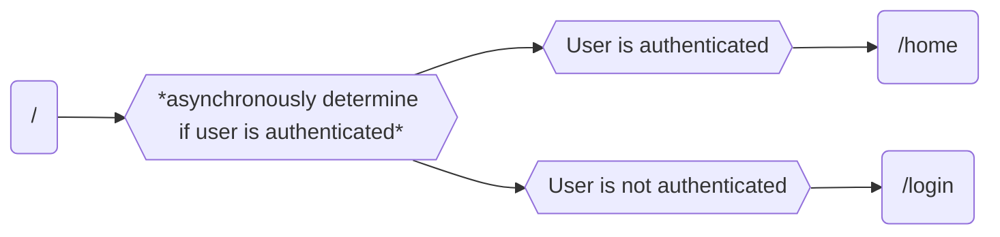
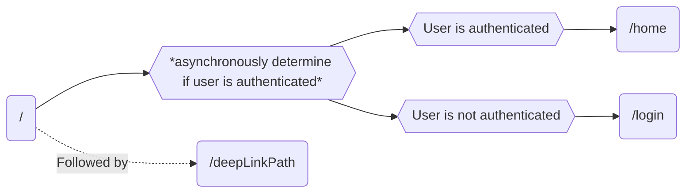

# go_router_bug_example
## The bug
When opening a deep link on iOS from a terminated state, the `GoRouter`'s `redirect` method handles `/` first, immediately followed by the expected deep link path.  
This is different from the behavior on Android when opening a deep link from a terminated state. Android will simply handle the expected deep link path.

`Insert screen recordings of each OS`
## What this project is
This project serves as a minimal reproducible sample that demonstrates this bug. Unfortunately, there is nothing minimal about handling deep links in an iOS project and there is some additional configuration that will need to be done for each individual who clones this project.
## Set up
This is a deep link bug, which requires the setting up of an [apple-app-site-association file (iOS)](https://developer.apple.com/documentation/xcode/supporting-associated-domains) and [assetlinks.json file (Android)](https://developer.android.com/training/app-links/verify-android-applinks) in the .well-known of a domain you own.

### iOS
After cloning this repository, you should follow the above documentation to upload an apple-app-site-association file to your domain. The AASA file should exist at `https://<fully qualified domain>/.well-known/apple-app-site-association` and look something like this:

```json  
{  
 "applinks": { "apps": [], "details": [ { "appID": "<teamId>.com.example.goRouterBugExample", "paths": [ "/", "/details" ] } ] }}  
```  
where `<teamId>` is your Team ID associated with the certificate you are signing the app with. If you are unsure what this value is, it can be found [here](https://developer.apple.com/account):

`Insert picture here`

You will, of course, also need to open the Runner project (located at `go_router_bug_example/ios/Runner.xcodeproj`) and sign the project. You can do this by selecting your "Runner" target > General > Signing.

`Insert picture here`

You will then need to add your associated domain you are deep linking through on this same page:

`Insert picture here`

### Android
Android configuration is not necessary to see this bug and is only useful to compare iOS deep link behavior to the (arguably better) Android deep link behavior. If you do want to set up this project to deep link through Android, follow [the steps for verifying Android App Links](https://developer.android.com/training/app-links/verify-android-applinks).

## How this creates issues
When launching a deep link from a terminated state on iOS, the `GoRouter`'s redirect method first handles `/`, followed by `/deepLinkPath`. For us, seeing `/` is a signal that we have just launched the app and should determine the users authentication status. When launching this initial location, the user will be navigated to a `/home` route or a `/login` route depending on if they are authenticated or not, respectively.


When we receive our initial location `/` immediately followed by `/deepLinkPath`, this introduces an issue where the `/deepLinkPath` route is pushed while authentication is being determined. Once the authentication is determined, the `/deepLinkPath` route is then replaced by either `/home` or `/login`.

This introduces a scenario where the `GoRouter` would have to act as a `ChangeNotifier` that notifies listeners whenever a deep link is handled. The service that determines the authentication status would have to listen to the `GoRouter` and refrain from pushing `/home` or `/login` when listeners are notified. This is a pretty hacky way to work around the race condition outlined above.
